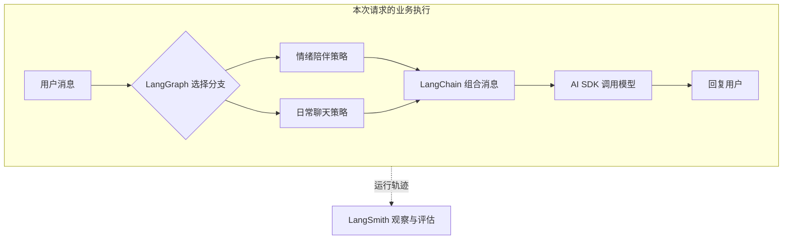

# LangChain、LangGraph、LangSmith：用法、区别与实践指南

本文结合同目录的「小满 · AI 女友工作流」讲解三者的关系。适合会写 TypeScript，希望理解 Agent 底层分工的开发者。运行方式见 [README](./README.md)。

文档核对日期：2026-09-29。**“当前示例”描述已经实现的代码；“扩展建议”表示还没有实现的能力。** API 以本项目锁文件对应版本为准。

## 1. 先明确三者分别解决什么

| 工具 | 核心问题 | 常见能力 | 当前示例中的实际用途 |
| --- | --- | --- | --- |
| **LangChain** | 如何组合模型应用的组件？ | 模型接口、消息与提示词、工具、Agent 高层接口 | 用 `ChatPromptTemplate`、`MessagesPlaceholder` 组合消息 |
| **LangGraph** | 下一步执行什么？状态如何传递？ | 节点、边、分支、循环、状态与持久化机制 | 运行对话流程，选择安慰或日常分支 |
| **LangSmith** | 发生了什么？效果好不好？ | 追踪、调试、评估与监控 | 可选记录工作流与模型调用 |

注意两个区别：

- LangChain 的能力远超过提示词模板。本例只选用了 `@langchain/core` 中的消息与提示词组件，**没有使用 `langchain` 包的 `createAgent`**。
- LangGraph 的节点可以执行普通 JS 函数，也可以调用模型。用了 LangGraph，不代表每个节点都使用 AI。

现代 LangChain 的高层 Agent 基于 LangGraph 构建；使用高层 API 时，通常不必手写全部图节点。需要明确控制分支、恢复位置或业务步骤时，才进一步使用 LangGraph 的图 API。[1]

三者也不要求一起使用。例如，普通 AI SDK 应用可以单独接入 LangSmith；LangGraph 节点可以调用 AI SDK，不必使用 LangChain 的模型接口。

## 2. 在这份 demo 中，四种能力怎样协作

Vercel AI SDK 是本例的模型通信层：它的 `streamText` 发起请求并读取流式回答。React Flow 则负责把后端执行事件画出来。



虚线代表记录关系。LangSmith 不参与本例的业务路由；如果没有启用追踪，聊天仍可以执行。这里讨论的是 LangSmith 的追踪与评估用途，其平台还有其他服务，不能将这个用途当成全部产品功能。

### 一条消息的具体流转

用户输入：“今天工作好累，想和你聊聊。”

| 顺序 | 节点 | 实际操作 | 可观察结果 |
| --- | --- | --- | --- |
| 1 | `receive` | 进入本轮工作流；HTTP 层已验证消息格式 | 接收事件 |
| 2 | `route` | 用关键词规则判断是否含“累”等词 | `direction = comfort` |
| 3 | `comfort` | 设置回应策略 | “先共情和倾听，再问一个温和的问题” |
| 4 | `memory` | 展示本次请求携带的历史条数 | 最近最多 12 条消息的数量 |
| 5 | `prompt` | 组合角色、策略、历史和当前问题 | 点击节点能看到实际消息列表 |
| 6 | `model` | 真实模式调用 AI SDK；演示模式输出固定文本 | 文本逐段出现 |
| 7 | `reply` | 完成图执行 | 完成事件 |

`daily` 分支不会执行。换成“周末想去喝咖啡”后，执行 `daily`，再汇合到后续节点。

**当前 `memory` 节点只做教学展示，并没有检索数据库。** 历史来自页面 React state，由前端随请求传入；`prompt` 使用这份历史。名称并不意味着已经有长期记忆。

## 3. LangChain 怎么用

阅读：[src/lib/answer-chain.ts](./src/lib/answer-chain.ts)。

核心操作是定义模板，再提供变量。以下为简化代码，可在已有依赖下理解其 API；完整角色文本与消息转换以源文件为准。

```ts
import { ChatPromptTemplate, MessagesPlaceholder } from '@langchain/core/prompts';
import { HumanMessage, AIMessage } from '@langchain/core/messages';

const template = ChatPromptTemplate.fromMessages([
  ['system', '你是虚构的 AI 伴侣小满。回应策略：{strategy}'],
  new MessagesPlaceholder('history'),
  ['human', '{question}'],
]);

const messages = await template.formatMessages({
  strategy: '先倾听，再温和提问。',
  history: [
    new HumanMessage('我今天一直在开会。'),
    new AIMessage('会议很多，听起来挺忙的。'),
  ],
  question: '现在有点累。',
});
```

`MessagesPlaceholder` 插入的是一组带角色的消息，不是把所有历史拼成一段字符串。模板渲染也不会自动发起模型请求；本例随后将消息转换成 AI SDK 所需格式，交给 `streamText`。

### 实践建议

- **保留消息角色**：系统规则、用户输入、历史回答分别传递。不要把用户输入拼进系统指令。
- **让提示词可单独检查**：模板、变量和模型调用分开，便于定位是上下文缺失，还是模型生成问题。
- **限制上下文规模**：最近 12 条只是教学限制；真实应用应按 token 预算裁剪，并根据需要增加摘要或检索。
- **谨慎转换消息类型**：本例只支持文本的 system/user/assistant。加入图片、工具调用或工具结果后，应显式映射对应类型，不能继续一律 `String(content)`，也不能把未知角色都当 assistant。
- **按需求引入组件**：如果只需要一个固定提示词，普通 TS 函数也能完成；模板复用、消息组合或 LangChain 生态集成较多时，它的价值才更明显。

若改为使用 LangChain 的 `createAgent` 管理模型和工具循环，应重新划分 AI SDK 的职责。例如保留 AI SDK 的 UI/流式适配能力，而不是让两个库同时控制同一轮模型循环。

## 4. LangGraph 怎么用

阅读：[src/lib/workflow.ts](./src/lib/workflow.ts)。

理解四个概念即可开始读代码：

| 概念 | 本例 | 实际含义 |
| --- | --- | --- |
| State | `question`、`direction`、`strategy`、`answer` | 一次运行中节点交换的数据 |
| Node | `route`、`comfort`、`prompt` 等 | 读取状态、执行操作并返回更新的函数 |
| Edge | `memory → prompt` | 固定的下一步 |
| Conditional edge | `route → comfort/daily` | 根据当前状态选择下一步 |

源文件中的关键结构可以简化为：

```ts
// 结构示意：state 的类型由 StateSchema 提供；省略其他节点定义。
.addNode('comfort', async () => ({
  strategy: '先共情和倾听，再问一个温和的问题。',
}))
.addConditionalEdges('route', state =>
  state.direction === 'comfort' ? 'comfort' : 'daily',
)
.addEdge('comfort', 'memory')
.addEdge('daily', 'memory')
```

节点返回部分状态更新；不要依赖直接修改传入对象来传播结果。[2]

### 实践建议

- **节点对应可解释的业务步骤**：需要单独观察、重试或恢复的操作适合独立成节点；不要为每一行代码创建节点。
- **业务数据放进状态**：为准备恢复的数据使用可序列化结构；密钥、网络连接和输出回调属于运行依赖。
- **控制循环**：增加“生成—检查—重写”时，同时限制重试次数、总时长和模型成本；失败要有明确出口。
- **区分错误**：临时网络故障可以有限重试；参数错误需要修正；权限不足应直接失败。
- **副作用要幂等**：发送消息、写入订单、修改偏好等操作可能在重试或恢复中重复执行，需使用请求 ID、业务唯一键等防止重复。[2][3]

### 持久化与本例的差距

当前 `.compile()` 没有配置 checkpointer，所以没有跨请求恢复能力。实现持久化时，需要明确的 thread 标识和合适的 checkpoint 存储；进程内内存存储不能保证服务重启后的恢复。[3]

本例还把 `messages` 存在请求闭包中，并每次请求创建图。这对单次教学运行足够，但如果直接加 checkpoint，恢复到 `model` 时闭包中的消息可能没有重建。应把必要数据纳入可恢复状态，或让模型节点从状态重新构建消息，再设计恢复流程。

同理，生产服务可以复用编译后的静态图，但用户数据必须通过状态或运行上下文传入，不能放到模块级可变数组中。

## 5. LangSmith 怎么用

阅读 `workflow.ts` 中的两个 `traceable`：

| 追踪名称 | 包裹范围 | 用途 |
| --- | --- | --- |
| `companion_workflow` | 一次图执行 | 关联这次请求及模式 |
| `companion_model` | 回复生成函数 | 检查生成步骤的耗时、结果或错误 |

通用写法如下。函数的输入与输出是可记录的数据；配置启用追踪后，再去 LangSmith 项目中确认实际接收情况。[4]

```ts
import { traceable } from 'langsmith/traceable';

const inspectStrategy = traceable(
  async (input: { direction: string }) => ({
    strategy: input.direction === 'comfort' ? '倾听' : '轻松聊天',
  }),
  { name: 'inspect_strategy' },
);

await inspectStrategy({ direction: 'comfort' });
```

环境变量：

```dotenv
LANGSMITH_TRACING=true
LANGSMITH_API_KEY=你的密钥
LANGSMITH_PROJECT=agent-stack-web-demo
```

### 追踪与评估有什么区别

- **追踪**：检查某次执行，比如为什么进入 `daily`、提示词是否包含历史、哪个步骤失败。
- **评估**：在一组样例上比较版本，比如新的分类方式是否减少误判、回答是否保持角色与语言要求。离线评估适合发布前比较，在线评估适合观察真实运行。[5][6]

### 实践建议

- **名称稳定**：按业务步骤命名，避免每次随机改名导致难以聚合。模型、提示词版本、应用版本、演示/真实模式可用 metadata 标识。
- **采集需要的数据**：不把密钥或无关个人资料放进输入、输出、metadata；按场景脱敏与采样。
- **明确上传生命周期**：短生命周期或 serverless 环境应按 SDK 文档处理后台回调及 flush，避免函数结束后轨迹尚未送出。[4]
- **不要把已启用当成已成功上传**：本例页面只知道环境变量开关，不能证明 LangSmith 服务已接收。
- **补全模型级观测**：本例 `companion_model` 是普通函数追踪，未显式上报标准 LLM 消息、token usage 或价格，不能据此声称已经有完整 token/成本监控。
- **模拟数据单独看**：通过 `mode` 区分本地固定回复和真实模型，避免混入质量评估。

本例的 `runId` 是自定义 metadata，不等同于 LangSmith 平台自动生成的 run ID。网页节点日志来自 NDJSON 事件，也没有调用 LangSmith 查询 API。

## 6. 哪些“记忆”和“回放”容易混淆

| 名称 | 存什么 | 当前实现 | 能否代替其他能力 |
| --- | --- | --- | --- |
| 页面会话历史 | 用户与 AI 的近期消息 | 有，刷新清空 | 不能代替服务端会话存储 |
| LangGraph checkpoint | 执行状态和恢复所需信息 | 没有 | 不自动成为跨会话用户偏好库 |
| 长期记忆 | 用户明确确认的偏好、历史事实等 | 没有 | 需要独立的数据管理与检索设计 |
| LangSmith trace | 运行记录，用于分析 | 可选 | 不应直接充当业务记忆数据源 |
| 页面逐步回看 | 已收到的节点事件 | 有 | 不会重新调用模型，也不是 checkpoint 恢复 |

此外，本例是确定性分支的聊天工作流。当前版本没有工具调用循环，也没有模型自主规划任务；有图、有角色设定，不足以证明已经实现自主 Agent。

## 7. 如何选型与逐步完善

以下是基于本例的工程建议，不是必须同时安装三套工具的规定。

| 需求 | 可以从哪里开始 |
| --- | --- |
| 简单聊天与流式输出 | AI SDK 加应用自己的消息管理 |
| 可复用消息模板、LangChain 组件集成 | 增加 LangChain 对应组件 |
| 明确分支、检查重试、人工介入、恢复执行 | 评估 LangGraph |
| 定位执行问题、比较提示词或模型版本 | 接入 LangSmith 或已有观测系统 |
| 模型自主选择工具并循环执行 | 选择一个 Agent 循环的主要实现，明确与工作流的边界 |

对“小满”，可以按三个具体目标完善：

1. **先改善对话质量**：把关键词分类替换为可验证的分类输出；覆盖“累但开心”等歧义表达。控制会话 token 预算，并处理空结果与流中断。
2. **再完善状态管理**：增加服务端会话与访问权限；需要恢复时接 checkpoint；用户偏好单独存储，并支持查看、修改、删除。
3. **最后建立质量回归**：准备固定样例，对分类正确率、上下文使用、回答约束、延迟和成本分别检查；用结果判断改动是否值得发布。

建议的评估样例：

| 输入/条件 | 希望检查的行为 | 当前演示的限制 |
| --- | --- | --- |
| “今天工作好累” | 先回应情绪，再询问 | 关键词能够命中 |
| “今天虽然累，但很开心” | 不应仅凭“累”当作负面情绪 | 当前规则会进入 comfort |
| 先说“我不喝咖啡”，再讨论周末 | 使用近期历史 | 仅真实模型模式有意义 |
| 连接中断或模型失败 | 显示失败，不显示完成 | 应单独做错误路径验证 |
| 刷新页面后继续聊天 | 清楚呈现历史是否保留 | 当前历史会清空 |

## 8. 阅读代码与官方资料

建议阅读顺序：

1. [事件与节点定义](./src/lib/contracts.ts)：理解页面能观察到什么。
2. [工作流](./src/lib/workflow.ts)：从条件边回看节点与状态。
3. [提示词组合](./src/lib/answer-chain.ts)：检查模型真正收到的消息。
4. [接口事件流](./src/app/api/ask/route.ts) 与 [React Flow](./src/components/workflow-canvas.tsx)：理解执行和可视化怎样连接。

官方资料：

- [1] [LangChain JS 概览](https://docs.langchain.com/oss/javascript/langchain/overview)
- [2] [Thinking in LangGraph](https://docs.langchain.com/oss/javascript/langgraph/thinking-in-langgraph)
- [3] [LangGraph Persistence](https://docs.langchain.com/oss/javascript/langgraph/persistence)
- [4] [LangSmith 自定义追踪](https://docs.langchain.com/langsmith/annotate-code)
- [5] [LangSmith Observability](https://docs.langchain.com/langsmith/observability)
- [6] [LangSmith Evaluation types](https://docs.langchain.com/langsmith/evaluation-types)

## English overview

LangChain provides composable AI application and agent components; this demo uses only its prompt/message utilities. LangGraph controls state and branching. LangSmith observes and evaluates execution. The Vercel AI SDK is the model transport in this implementation. Local replay, checkpoints, conversation history, and long-term memory are distinct capabilities. Current limitations and production recommendations are explicitly separated throughout this guide.
