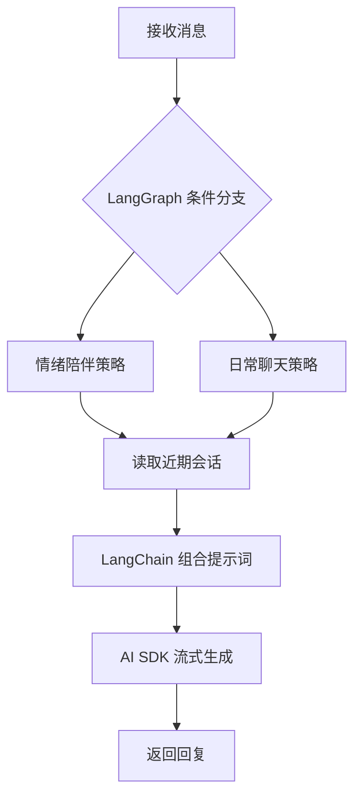

# 小满 · AI 女友工作流教学网页

用虚构成年 AI 伴侣「小满」的聊天场景，展示 **LangChain、LangGraph、LangSmith + Vercel AI SDK** 的分工。React Flow 图示接收后端真实执行事件，可以点击节点、缩放、回看执行步骤。

## 运行

需要 Node.js 20.9+、pnpm。在本目录运行：

```bash
pnpm install --frozen-lockfile
cp .env.example .env.local
pnpm dev
```

打开 http://localhost:3000。默认「本地演示」无需 API Key：实际执行 LangGraph 与 LangChain，仅模型回复使用本地固定文本，界面明确标记模拟回复。切换「真实模型」后，填写 `.env.local` 的 `OPENAI_API_KEY`、`AI_MODEL`；可选 `OPENAI_BASE_URL`。当前 provider 使用 OpenAI Responses API，兼容服务也需要支持该接口。

## 怎么观察

1. 发送“今天工作好累”：观察 `route → comfort` 分支。
2. 发送“周末想去喝咖啡”：观察 `route → daily` 分支。
3. 两条分支都进入 `memory → prompt → model → reply`。点击任意节点查看职责与本轮时间记录。
4. 完成后拖动“逐步回看”，检查每个真实事件发生时的节点状态。未被选择的分支始终等待。
5. 真实模型模式下继续对话：近期历史通过 LangChain 的 `MessagesPlaceholder` 进入模型。演示模式的固定回复不模拟真正的语义理解。



**LangSmith 是旁路观察能力**：它不决定下一节点。启用后记录工作流、LangChain/LangGraph 运行以及显式包裹的模型调用；网页展示的是本地节点事件，不是从 LangSmith 查询回来的轨迹，也不是模型内部思维链。

| 层            | 代码位置                                   | 实际职责                                                               |
| ------------- | ------------------------------------------ | ---------------------------------------------------------------------- |
| LangGraph     | `src/lib/workflow.ts`                      | 状态、节点与条件边；每次请求独立建图与上下文                           |
| LangChain     | `src/lib/answer-chain.ts`                  | `ChatPromptTemplate`、`MessagesPlaceholder` 组合角色、策略、历史和输入 |
| Vercel AI SDK | `workflow.ts` 的 `streamText`              | 唯一模型调用入口，逐段文字通过事件流返回浏览器                         |
| LangSmith     | `workflow.ts` 的 `traceable`               | 根执行、模型子任务追踪，记录请求关联 ID 和模式                         |
| React Flow    | `src/components/workflow-canvas.tsx`       | 展示节点、条件分支、实际状态与流转连线                                 |
| 事件协议      | `src/lib/contracts.ts`、`api/ask/route.ts` | NDJSON：节点状态、文本增量、完成、失败                                 |

## 模型与追踪配置

```dotenv
OPENAI_API_KEY=你的密钥
AI_MODEL=你的模型ID
LANGSMITH_TRACING=true
LANGSMITH_API_KEY=你的LangSmith密钥
LANGSMITH_PROJECT=agent-stack-web-demo
```

配置后重启开发服务器。在 LangSmith 项目中查看 `companion_workflow`，元数据 `runId` 可关联一次请求。`LANGSMITH_TRACING=true` 时演示与真实模式均可产生追踪，`mode` 元数据区分二者。页面“已启用轨迹发送”表示配置启用，不代表远端已经成功接收。开启追踪会将对话发送到所配置的 LangSmith 服务。密钥仅在服务端使用，不使用 `NEXT_PUBLIC_`，不提交 `.env.local`。

## 设计边界与实践

- **显式流程**：分支是教学用的关键词规则；可以替换为结构化模型分类。角色设定为虚构 AI，不宣称现实身份或能力。
- **单一职责**：LangChain 组合消息，AI SDK 调模型，LangGraph 决定路径；没有叠加两个 Agent 循环。
- **会话范围**：仅当前页面内存中的最近 12 条历史，刷新清空。没有数据库、长期记忆或持久化 checkpoint。
- **执行限制**：输入校验、60 秒超时、模型最多一次重试与输出 token 上限。页面对错误明确提示；未完成执行不会显示为完成。
- **学习用途**：当前无登录、账户隔离、调用限流或费用配额；对外提供真实模型服务前，需要在应用层补充这些能力。

## 验证

```bash
pnpm typecheck
pnpm build
```

官方参考：[React Flow 自定义节点](https://reactflow.dev/learn/customization/custom-nodes)、[LangGraph Graph API](https://docs.langchain.com/oss/javascript/langgraph/use-graph-api)、[LangSmith 自定义追踪](https://docs.langchain.com/langsmith/annotate-code)、[AI SDK 文本生成](https://ai-sdk.dev/docs/ai-sdk-core/generating-text)。

## English

An interactive fictional adult AI companion demo. LangGraph routes emotional support versus casual chat; LangChain composes persona and recent history; Vercel AI SDK streams a model response; LangSmith optionally traces execution. React Flow visualizes real backend events and supports step replay. Demo mode needs no API key and uses fixed mock text; live mode requires a Responses-compatible model. Conversation history lives only in the current page, with no persistent memory.
