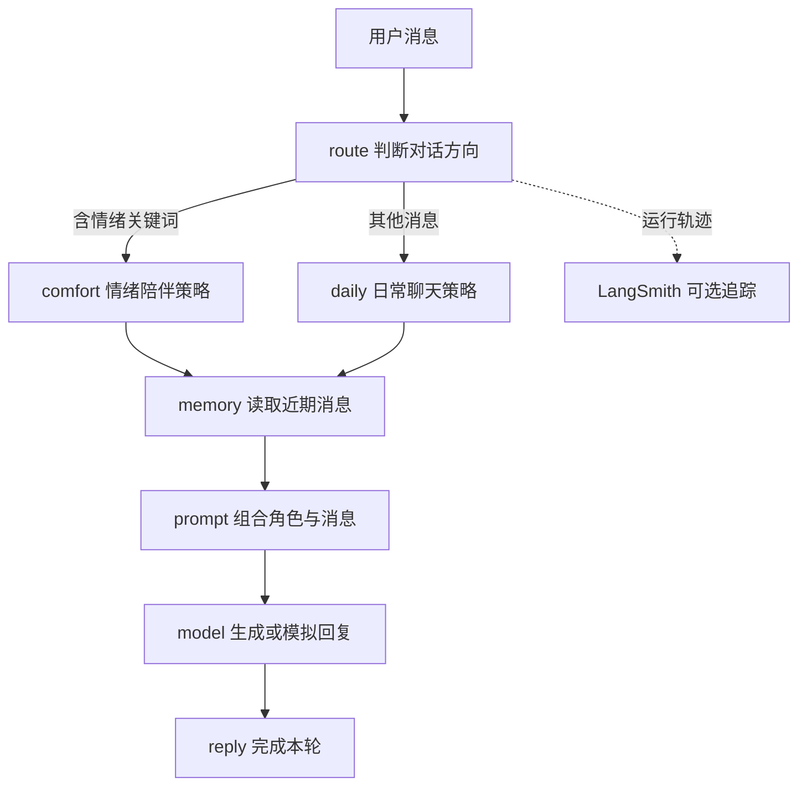

# 从一句话看懂 Agent 工作流：LangChain、LangGraph 与 LangSmith

这篇文章既是 **Agent 组件协作的入门说明**，也是「小满」工作流教学网页的使用手册。你可以先在本地演示模式观察一次真实的图执行，再沿着事件和代码弄清：谁组装消息，谁决定下一步，谁调用模型，谁记录运行过程。

「小满」是虚构的成年 AI 伴侣角色，用聊天场景展示工作流。项目使用 Next.js、LangChain、LangGraph、Vercel AI SDK、LangSmith 和 React Flow。默认无需 AI 密钥：演示模式会执行图和提示词模板，只有回复文字是本地模拟的。

## 先建立一个直觉

假设用户说“今天工作好累，想和你聊聊”。网页先判断该走“情绪陪伴”还是“日常聊天”分支，再把角色设定、分支策略、近期对话和当前消息组成模型输入，最后逐段显示回答。



**Node（节点）执行一步操作，Edge（边）决定下一站，State（状态）在步骤间传递数据。**例如 `route` 节点用关键词计算 `direction`，条件边读取它并选择 `comfort` 或 `daily`。一个节点不等于一次模型调用：本项目只有真实模式的 `model` 节点调用模型，其他节点执行普通代码。React Flow 只是把后端发来的事件画出来，不控制后端的执行顺序。

| 组件 | 解决什么问题 | 本项目实际使用的能力 |
| --- | --- | --- |
| LangChain | 怎样组织模型需要的消息？ | 用 `ChatPromptTemplate` 和 `MessagesPlaceholder` 组合角色、策略、历史和问题 |
| LangGraph | 步骤按什么顺序执行、走哪条分支？ | 用状态、节点、固定边和条件边运行一轮对话 |
| Vercel AI SDK | 怎样向模型发请求并读取回复？ | 真实模式用 `streamText` 流式生成文字 |
| LangSmith | 运行时发生了什么？ | 可选地向远端记录工作流和模型调用 |
| React Flow | 怎样在网页上看执行过程？ | 显示节点状态、分支和本轮事件回看 |

当前路线和步骤由代码明确规定；关键词只选择回应策略，没有调用分类模型或工具。LangSmith 是旁路观察能力，不参与路由；关闭远端追踪也不影响本地工作流和图示。

## 什么时候需要这些组件？

如果只是一次简单模型调用，直接组装消息并调用模型就够了。需要复用角色和历史消息的结构时，可以引入 LangChain 提示词组件；需要明确的多步骤流程、分支或状态传递时，LangGraph 更有价值；需要排查运行路径、耗时和模型调用时，再启用 LangSmith 追踪。三者可以分别使用。

本项目选择“消息模板 + 固定工作流 + 单个模型调用”的组合，方便观察每层的职责。`memory` 节点只显示浏览器传来的历史条数；它没有查询数据库，也没有实现长期记忆。更多选型和 API 细节见 [LangChain / LangGraph / LangSmith 指南](./LANGCHAIN_LANGGRAPH_LANGSMITH_GUIDE.md)。

## 运行网页并做三个实验

需要 Node.js **20.9+** 和 pnpm。在仓库根目录运行：

```bash
cd KRISIN2026/ai-agent-demo/agent-stack-web
pnpm install --frozen-lockfile
cp .env.example .env.local
pnpm dev
```

打开 [http://localhost:3000](http://localhost:3000)。如果 3000 端口被占用，以终端实际输出的网址为准。页面默认选择“本地演示”，不需要填写 `OPENAI_API_KEY`。`.env.local` 已被 Git 忽略，仅供本机服务端读取。

1. **观察情绪分支。**发送预填的“今天工作好累，想和你聊聊。”；`route` 会因“累”选择 `comfort`。点击 `route` 和 `comfort`，查看判断结果和写入的策略。`daily` 不会执行。
2. **对比日常分支。**点击“日常聊天分支”示例并发送。`route` 会选择 `daily`，随后两条路线都汇入 `memory → prompt → model → reply`。点击 `prompt`，查看这一轮实际组装出的消息；它包含当前页面携带的近期对话。
3. **回看真实事件。**运行完成后拖动“逐步回看”滑块。图示按本轮收到的节点事件逐步显示；“显示完整路径”恢复最终视图。滑块只是浏览器回放，拖动不会重新运行工作流。

演示模式仍会逐段显示文字，便于观察流式界面；这些字由本地固定示例产生，**不能用来判断真实模型的语义理解或回答质量**。若要观察模型输出，切换到“真实模型”，按下文配置服务端。网页没有把模型内部推理过程显示为节点或轨迹。

## 从页面走到代码

| 页面上看到的内容 | 代码入口 | 实际行为 |
| --- | --- | --- |
| 两种分支与节点状态 | [`src/lib/workflow.ts`](./src/lib/workflow.ts) | 建立 LangGraph 状态图；`route` 用关键词写入 `direction`，条件边选择一个分支 |
| 角色、策略与近期消息 | [`src/lib/answer-chain.ts`](./src/lib/answer-chain.ts) | LangChain 模板保留消息角色，再转换为 AI SDK 消息 |
| 逐段回复与可选追踪 | [`src/lib/workflow.ts`](./src/lib/workflow.ts) | 真实模式调用 `streamText`；`traceable` 包裹工作流和模型任务 |
| 请求与执行事件 | [`src/app/api/ask/route.ts`](./src/app/api/ask/route.ts)、[`src/lib/contracts.ts`](./src/lib/contracts.ts) | 校验输入，通过 NDJSON 顺序发送 `node`、`token`、`complete` 或 `error` |
| 图示、节点详情与回看 | [`src/app/page.tsx`](./src/app/page.tsx)、[`src/components/workflow-canvas.tsx`](./src/components/workflow-canvas.tsx) | 读取事件并更新 React Flow；回看只重放已收到的节点事件 |

一次请求由 `POST /api/ask` 接收 `{question, history, mode}`。`question` 限制为 1–1000 字符，历史最多 12 条；页面把当前会话的最近 12 条消息随请求发给服务端。后端为每次请求单独建立图和状态，按执行顺序发送一行一个 JSON 事件。`node` 事件带节点、状态、说明和时间；`token` 是回复增量；只有整个图正常结束才发送 `complete`。出错时发送 `error`，页面提示失败，不会把这轮显示为已完成。

当 `route` 判断含“难过、累、烦、委屈、压力、孤独”之一时，条件边选择 `comfort`；其他输入选择 `daily`。这只是教学规则，不能视为可靠的情绪识别。`prompt` 节点使用 LangChain 组装消息，但模板本身不调用模型；真实的外部模型调用只发生在 `model` 节点。演示模式在同一节点输出本地示例文本。

## 切换到真实模型与 LangSmith

在 `.env.local` 填写服务端模型配置，然后重启 `pnpm dev`：

```dotenv
OPENAI_API_KEY=你的密钥
AI_MODEL=你的模型ID
# 使用其他兼容服务时按需设置：
# OPENAI_BASE_URL=https://你的服务/v1
```

网页选择“真实模型”后才会调用外部模型。当前代码通过 AI SDK 的 OpenAI provider 使用 **Responses API**；第三方服务即使提供 OpenAI 兼容端点，也需要实际支持该接口及所填模型。`.env.example` 的模型值是配置示例，能否在你的服务上使用应实测。模型密钥只在服务端使用，不要加 `NEXT_PUBLIC_` 前缀，也不要提交 `.env.local`。真实模式会把当前消息与随请求携带的近期历史发给模型服务。

可选启用 LangSmith 云端追踪：

```dotenv
LANGSMITH_TRACING=true
LANGSMITH_API_KEY=你的LangSmith密钥
LANGSMITH_PROJECT=agent-stack-web-demo
```

重启后，在对应 LangSmith 项目查找 `companion_workflow`；元数据中的 `runId` 可关联本轮请求，`mode` 区分演示与真实模式。两种模式都可以启用追踪。页面的“已启用轨迹发送”只说明服务端开启了配置，**不证明远端已成功接收**；网页上的节点事件来自本地请求，不是从 LangSmith 拉回的记录。开启远端追踪前，应确认对话内容允许发送到该服务。仅想看本地路径与回看，不需要配置 LangSmith。

## 设计边界与实践

- **显式流程**：分支是教学用的关键词规则；可以替换为结构化模型分类。角色设定为虚构 AI，不宣称现实身份或能力。
- **单一职责**：LangChain 组合消息，AI SDK 调模型，LangGraph 决定路径；没有叠加两个 Agent 循环。
- **会话范围**：仅当前页面内存中的最近 12 条历史，刷新清空。没有数据库、长期记忆或持久化 checkpoint。
- **执行限制**：输入校验、60 秒超时、真实模型最多一次重试与 700 个输出 token 上限。页面对错误明确提示；流中已到达的增量文字可能仍在当前页面，但未完成的回复不会写成一条完成的助手消息。
- **学习用途**：当前无登录、账户隔离、调用限流或费用配额；对外提供真实模型服务前，需要在应用层补充这些能力。
- **观察与评估**：节点事件能说明代码走过哪些步骤，LangSmith 可记录远端轨迹；两者都不自动证明回复正确或稳定。评估实际效果还需要测试对话和人工判断标准。

## 验证

```bash
pnpm typecheck
pnpm build
```

官方参考：[React Flow 自定义节点](https://reactflow.dev/learn/customization/custom-nodes)、[LangGraph Graph API](https://docs.langchain.com/oss/javascript/langgraph/use-graph-api)、[LangSmith 自定义追踪](https://docs.langchain.com/langsmith/annotate-code)、[AI SDK 文本生成](https://ai-sdk.dev/docs/ai-sdk-core/generating-text)。
