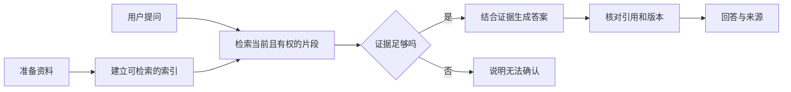
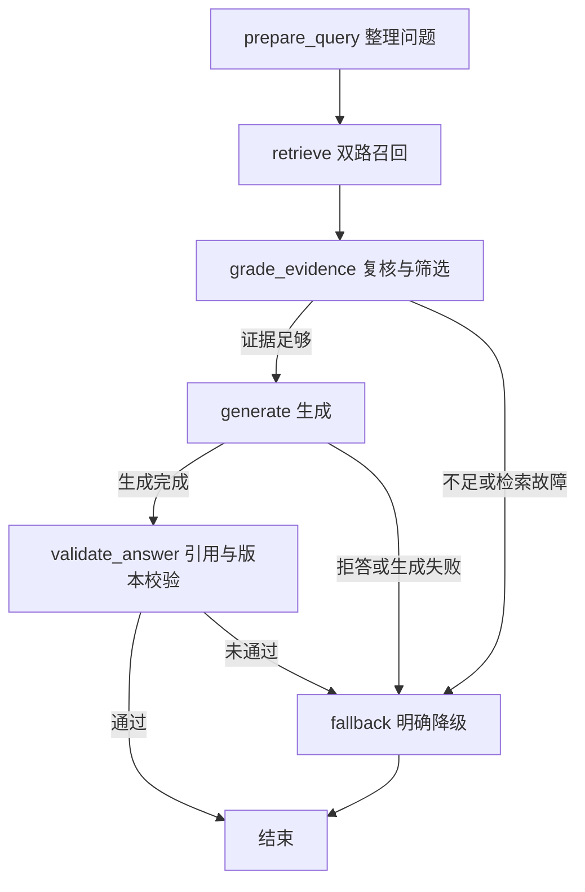

# RAG 入门与动手实验：让回答有据可查

这篇文章同时是 **RAG 的入门说明**和 **RAG Lab 的使用手册**。读完后，你应该能回答三个问题：RAG 是什么？自己的需求什么时候值得用 RAG？如何从一份资料做出可核对的回答？不要求先了解向量数据库、LangChain 或 LangGraph。

RAG Lab 是一个在本机运行的教学项目，使用 Hono、PostgreSQL/pgvector、LangChain、LangGraph、Vercel AI SDK 和 React Flow。示例知识由我们自行编写，不包含真实用户记忆、业务制度、密钥或所参考课程的正文。项目不依赖 Cloudflare。

## 先看一个例子

假设某公司有一份经常修改的差旅制度。员工问：“现在两天的住宿上限是多少？”语言模型可能根据旧印象给出一个数字，也可能坦言不知道。更可靠的做法是：

1. 从员工**有权查看、当前生效**的制度中找到相关段落。
2. 把段落连同标题和版本交给模型，让它只依据这些材料作答。
3. 回答附上来源；如果制度没有覆盖这个问题，就说明无法确认。

这就是 RAG 的核心做法。**RAG = Retrieval-Augmented Generation，检索增强生成**：在生成答案前，先找出本次问题需要的外部信息，再把它放进本次上下文。检索可以使用向量、关键词、数据库查询或几种方式组合；RAG 不等于“把所有资料塞进提示词”，也不等于某个向量数据库产品。[LangChain 的检索说明](https://docs.langchain.com/oss/javascript/deepagents/retrieval)也将“在提问时取回相关外部知识”作为它的基础。



> **最重要的边界**：检索到“相近”的资料，不代表资料真正回答了问题；有引用编号，也不代表每句话都有证据支持。RAG 降低了盲猜的机会，但不会自动消除幻觉。

## 1. 什么时候用 RAG？

可以先问自己：“答案是否依赖**当前输入以外**、又不能每次完整提供的信息？”

| 需求 | 合适的起点 | 原因 |
|---|---|---|
| 翻译或总结用户刚贴出的短文 | 直接把原文交给模型 | 所需信息已经在当前输入中 |
| 只有一小份稳定规则 | 直接放进提示词或代码配置 | 额外检索会增加复杂度 |
| 回答大量、私有、常更新的文档问题 | RAG | 每次只取少量相关资料，并能显示来源 |
| 查询账户余额、订单状态、库存等精确值 | 带权限校验的业务 API / SQL | 需要权威实时数据，不该由相似文段推断 |
| 希望模型学会固定格式或表达风格 | 提示词或微调 | 这是行为问题，不是检索外部事实的问题 |
| 从当前对话理解“那它呢？” | 对话上下文；必要时改写检索问题 | 最近几轮消息通常不用建向量索引 |
| 从长期历史中按需找稳定偏好或事实 | 记忆管理 + 检索 | 还需要提取、更新、停用、冲突和删除机制 |

RAG 与其他方法可以配合。**微调**会改变模型参数；**RAG**只给本次回答补充资料，不会改变参数，也不会自动形成长期记忆。联网搜索可以充当一种检索来源，但企业知识库通常还需要自己的权限、版本和删除规则。最初的问答产品通常可以从固定的“检索 → 回答”流程做起，再按实际需要增加改写、判断和校验节点；不必一开始就让 Agent 自行决定每一步。[LangChain 的架构概览](https://docs.langchain.com/oss/javascript/deepagents/retrieval)区分了固定检索、Agent 自主检索与带校验的混合流程。

**快速判断**：资料少且稳定，先直接提供；资料多或常变，考虑 RAG；需要精确操作性数据，接业务接口；需要改变输出习惯，先检查提示词或微调。

## 2. RAG 到底怎么工作？

RAG 有两条不同时间发生的链路。把它们分开，是理解系统的关键。

### A. 建索引：资料变化时执行

```text
原文 → 解析与清理 → 切成可理解的片段 → 为片段生成 Embedding → 保存正文、向量和元数据
```

- **原文与解析**：输入可能是 Markdown、网页、PDF、表格或数据库记录。解析需要保留标题、表头、数字、否定词、适用条件等信息。这个 Demo 接收粘贴的 Markdown/纯文本；没有 PDF/OCR 解析器。
- **切块（Chunk）**：一整本手册可能超过模型的上下文容量，也很难精确定位。切块让检索单位足够小，同时要尽量把“条件与结论”留在同一块。重叠（Overlap）能缓解切分边界，但太多会造成重复。Demo 默认按字符切约 600/80，这只是实验起点，**字符数不是 Token 数**。
- **Embedding**：用模型把一段文本变成一组数字，即向量。语义相近的文本通常会更接近。索引和提问必须处在兼容的向量空间；维度相同不代表两个模型可以混用。
- **元数据与发布**：片段除了正文，还应有来源 ID、标题、版本、租户或权限范围。文档更新后，旧版不应继续被召回。

这些工作通常在文档新增或变更时完成，**不应该每次提问都重新解析全部资料和计算全部向量**。本 Demo 的导入请求会等待索引完成，并记录任务状态；它还没有后台队列、PDF 处理或任务恢复。

### B. 提问：每次查询时执行

```text
问题 → 整理查询 → 在允许的范围内召回候选 → 判断证据是否足够
     → 组装少量证据 → 生成 → 校验引用和版本 → 返回
```

“检索到了 8 个候选”和“给模型 8 个候选”是两回事。初步召回尽量减少漏掉答案；最终上下文则要控制数量、重复和长度。资料不足时应结束并说明无法确认，而不是强行写出一个答案。生成完成后，还要确认引用指向本轮真实提供的片段；若生成过程中原文被更新，旧引用也不应直接发布。

### 检索的三种方式

- **向量检索**：给问题也生成向量，找距离近的片段。适合表达不同、意思接近的问题；不保证识别某个精确编号。
- **关键词检索**：匹配问题里的具体词或标识。适合错误码、函数名、制度编号等；可能漏掉同义表达。
- **混合检索**：同时做两路召回，再合并排名。本 Demo 使用 RRF（Reciprocal Rank Fusion）：每路按排名贡献 `1 / (60 + 名次)`，同一片段的贡献相加。它避免直接把不同量纲的原始分数相加，但不能补回两路都没找到的资料。

pgvector 的 `<=>` 计算余弦**距离**，越小越接近；Demo 展示 `1 - 距离` 作为相似度。相似度 0.8 **不是**“答案有 80% 的概率正确”。中文关键词支路使用二元组和完整英文标识的覆盖率，**不是 BM25，也不是完整中文分词器**。规模较大时可以评测专用分词、近似向量索引与 Reranker；本 Demo 的精确扫描和简单打分适合教学小库。[pgvector 文档](https://github.com/pgvector/pgvector)

### 如果要为自己的资料做第一版

1. 选一小批你有权使用的资料，给每份资料稳定 ID、标题、版本和访问范围。确认文中确实有可回答的问题；资料本身不存在的答案无法靠更好的提示词补出。
2. 先人工写 20～50 道真实提问，标记期望来源，并混入一些**看起来相近但没有答案**的问题。它们是后续判断改动是否有效的基线。
3. 做最简单的索引链路：清理文本、按语义切块、给每块附上标题和来源、生成 Embedding，再保存正文与向量。更新资料时发布新版本，不让旧版混入当前查询。
4. 做最简单的查询链路：先按权限和当前版本缩小范围，再召回片段，限制最终证据的数量；证据不足就拒答，有证据才生成并显示来源。可先从关键词或向量单路开始，确有漏召回再比较混合检索。
5. 用第 2 步的问题集同时看**能否找对资料、能否正确拒答、答案是否受引用支持**。定位问题后只改切块、检索、门禁或生成中的一个环节，再重新比较。

下面的 RAG Lab 把这些步骤浓缩成了一个可操作的小项目。

## 3. 现在动手：运行 RAG Lab

需要 Node.js 22+、pnpm、PostgreSQL 17 和 pgvector。项目锁定 pnpm 11.8.0。数据库可以选 Docker 或本机 PostgreSQL；两种方式共用默认端口，只启动其中一种。

在仓库根目录执行：

```bash
cd KRISIN2026/ai-agent-demo/rag-system
pnpm install
cp .env.example .env.local
```

**使用 Docker 启动数据库：**

```bash
docker compose up -d --wait
pnpm db:init
pnpm seed
pnpm dev
```

**本机已安装 PostgreSQL 17 与 pgvector：**确保 `initdb`、`pg_ctl`、`postgres` 在 PATH 中，且 pgvector 与该 PG 版本匹配。

```bash
pnpm db:local
pnpm db:init
pnpm seed
pnpm dev
```

打开 [http://127.0.0.1:3016](http://127.0.0.1:3016)。首次不需要 AI 密钥：`.env.example` 默认 `RAG_MODE=demo`。其中 PostgreSQL、切块、检索、LangGraph 和界面确实运行；“向量”由本地词特征哈希计算，“回答”是命中资料的原文摘录。**它不能代表真正的语义 Embedding 或 LLM 生成效果。**

`db:local` 只管理本项目 `.data/postgres`，监听 `127.0.0.1:55432`；数据目录与 `.env.local` 被 Git 忽略。后续已有数据时，启动数据库和 `pnpm dev` 即可。`pnpm db:stop` 停止项目原生数据库；Docker 可用 `docker compose stop` 保留卷。`pnpm db:init` 可以重复执行，不清空现有文档。

### 按这个顺序做三个实验

**实验 1：找到有答案的问题。**在“知识库”确认已经有 8 份示例。回到“问答实验”，输入“RRF 为什么按排名融合？”。预期可以看到包含 `[S1]` 等编号的摘录及对应来源。展开“召回候选”，比较向量相似度、关键词覆盖和融合后的排名。数字只是排序线索，请同时阅读原文。

**实验 2：看清状态流转。**页面中的 React Flow 图会标出“整理查询 → 召回资料 → 证据门禁 → 生成答案 → 校验引用 → 结束”。紫色为执行中，绿色为完成；没走到的分支变灰。点击“召回资料”看候选数量，点击“证据门禁”看哪些候选进入最终证据。每个节点可以查看进入前状态、本节点更新和完成后状态。演示模式常在几十毫秒内结束，可以点“播放回看”、拖动滑块或按“上一步/下一步”。回放的 500ms 间隔只为了阅读，时间线里的耗时仍来自实际运行。

**实验 3：没有答案也要正常结束。**输入“火星温室番茄种植温度是多少？”。示例知识并不包含种植温度。预期回答“资料不足”，流程从证据门禁走向“明确降级”，生成和引用校验显示为未执行。这个实验说明：即使数据库找到了**最相近**的候选，也不能把它当成问题的答案。

之后可以在“知识库”新增一份自己编写的**非敏感**资料并提问。保存同一个 ID 的不同正文会发布新版本，删除会清理该来源的片段。恢复示例会覆盖相同示例 ID 的编辑内容，网页会先提示。最后打开“评测”，看每道题的结果；改变资料后可比较指标的变化。

## 4. 从 Demo 映射到代码

| 概念 | 在页面看什么 | 代码入口与实际行为 |
|---|---|---|
| 建索引 | 知识库中的文档版本与片段数 | `src/store.ts` 清理、切块、生成向量；正文与新片段一次事务发布 |
| 范围过滤 | 只能检索本地演示范围 | `src/store.ts` 在 SQL 中按租户、当前版本和模型 profile 限定候选 |
| 向量 / 关键词 / 混合 | 切换检索方式并比较候选 | `src/retrieval.ts` 的中文二元组、演示向量、RRF 与证据选择 |
| 问答路径 | React Flow 节点和时间线 | `src/workflow.ts` 的 LangGraph 节点、条件边和实际事件 |
| 回答与引用 | `[S1]`、来源卡片、版本 | `src/models.ts` 生成；`src/workflow.ts` 校验引用并复核版本 |
| 接口与事件 | 问答、导入、评测操作 | `src/app.ts` 的 Hono API 与 SSE；`web/events.js` 解析事件 |
| 评测 | Hit Rate@5、MRR@5、逐题状态 | `src/fixtures.ts` 与 `src/evaluation.ts` |

技术组件的职责是：LangChain 表示文档、递归切块并组织生成提示词；LangGraph 管理问答节点和条件分支；AI SDK 在真实模式调用 Embedding 与生成模型；PostgreSQL 保存权威正文、版本、任务及向量；React Flow 只负责**显示**工作流，不决定后端执行。对照[官方 LangChain 检索概览](https://docs.langchain.com/oss/javascript/deepagents/retrieval)，这个 Demo 属于检索后生成、再加证据与引用校验的固定流程，不是会自行决定何时使用工具的自主 Agent。



**Node（节点）**做一件事，**Edge（边）**决定下一站，**State（状态）**传递问题、查询、候选、证据与结果。后端在节点真正开始和结束时通过 `POST /api/query/stream` 发 SSE 事件：`progress` 包含 traceId、递增序号、节点、实际耗时及状态摘要；通过校验后才发送最终 `result`。普通 `POST /api/query` 仍可一次性拿结果。快速运行不会被人为放慢，回看只在浏览器端重放已收到的事件。图只显示**查询**流程；导入、删除和评测步骤没有画在这张图上。

生成正文不会作为未校验的进度事件提前展示。来源片段属于不可信数据，网页按文本渲染。`[S1]` 与结构化引用 ID 必须来自本轮证据；这个检查只能证明“引用 ID 存在”，**不能证明每个句子在事实上都受到引用支持**。因此后面还需要人工或专门的忠实度评测。

## 5. 把演示切换到真实 AI 模型

AI 配置参考相邻 `../agent-stack-web/.env.example`，沿用 `OPENAI_API_KEY`、`AI_MODEL`、`OPENAI_BASE_URL` 命名，仅在服务端读取。复制模板后编辑被 Git 忽略的 `.env.local`：

```dotenv
RAG_MODE=live
OPENAI_API_KEY=填写服务端密钥
AI_MODEL=填写服务实际支持的聊天模型
# OPENAI_BASE_URL=https://your-provider.example/v1
EMBEDDING_MODEL=text-embedding-3-small
EMBEDDING_DIMENSIONS=1536
```

重启 `pnpm dev`，再运行 `pnpm seed` 或逐份重新保存文档，以真实 Embedding 重建索引。仅修改 env、不重建索引，旧 Demo 向量不会参与新模型查询。`AI_MODEL` 的模板值沿用相邻项目命名；是否受你的服务支持须实测。

Embedding 服务可以独立配置 `EMBEDDING_API_KEY` 和 `EMBEDDING_BASE_URL`，留空时复用 `OPENAI_*`。服务需要支持相应 Embedding 接口与模型；生成服务需要 OpenAI 兼容 Chat Completions 与 JSON Schema 结构化输出。只有聊天模型、没有 Embedding 服务，无法完成真实模式的索引。外部服务失败会显示失败，不会悄悄退回演示模式。

| 环境变量 | 含义 |
|---|---|
| `DATABASE_URL` | PostgreSQL 连接；已有数据库也可填写自己的连接串 |
| `RAG_TENANT_ID` | 本地演示的服务端固定范围；浏览器不能自行改租户 |
| `CHUNK_SIZE` / `CHUNK_OVERLAP` | 切分字符数与重叠字符数 |
| `RECALL_K` | 各路初步召回上限 |
| `CONTEXT_K` / `CONTEXT_CHAR_BUDGET` | 最终证据数量及字符预算 |
| `MIN_VECTOR_SCORE` / `MIN_KEYWORD_SCORE` | 演示用证据阈值，需用自己的问题集校准 |
| `LANGSMITH_TRACING` | 默认关闭；开启会将工作流状态发送给远端服务 |

换 Embedding 地址、模型或维度，等于换了一套向量空间。本项目用 `embedding_profile` 将两边隔开，页面会标记需要重建的资料；切块配置变化也会触发下次保存时重建。开启 LangSmith 前应确认问题和来源允许上传：默认页面轨迹只在本地显示，**不是自动脱敏的生产观测系统**。

## 6. 如何判断一个 RAG 系统是否真的有效？

先准备一份问题集，给每题标注“哪些来源能够回答”以及“这题本来就没有答案”。同时放入精确编号、中文口语、同义表达、否定词、版本更新和相近但不能回答的问题。至少分开检查三层：

1. **找到了吗？** 相关资料是否进入候选。看 Recall@K、Hit Rate@K 和首个相关来源的排名（MRR@K）。
2. **选对了吗？** 最终证据是否足够、是否来自当前版本和允许的范围；应拒答时有没有拒答。
3. **答对了吗？** 回答是否事实正确、是否受证据支持，引用是否真的支持对应句子。

本 Demo 的“评测”有 **8 道有答案、1 道无答案**，只测检索和基础证据门禁，计算 Hit Rate@5、MRR@5 与逐题通过状态。2026-09-29 用内置合成资料在本地演示模式运行得到 9/9、Hit Rate@5 100%、MRR@5 0.8125。**这不是独立保留集，也不代表真实 Embedding 或模型生成质量。**修改示例资料后，先恢复示例再比较基线。生成正确性、忠实度和引用支持度仍需另做标注。

遇到坏答案时，按链路定位，而不是先改提示词：

| 观察到的问题 | 先检查什么 |
|---|---|
| 原文确实有答案，但候选没有 | 解析、切块、权限范围、模型 profile、查询和召回方式 |
| 有候选，但正确来源排得很后 | 关键词/向量两路结果、RRF；必要时评测重排 |
| 来源进入最终证据，但答案仍错 | 条件是否被切断、提示词、生成模型、事实与引用校验 |
| 不该回答的问题却给出肯定结论 | 相近无答案样本、阈值、证据充分性与拒答策略 |
| 文档改了还答旧内容 | 当前 revision、重新索引、缓存和引用版本 |

每次尽量只改一个变量，在同一问题集上比较质量、耗时和费用。总费用包括文档与查询 Embedding、可选改写/重排、生成输入输出、数据库和存储。模型名或价格本身不能证明在你的资料上效果更好。

## 7. 上线前还需要什么？

这个项目是单机教学服务，只绑定 `127.0.0.1`。它没有真实登录、文档级 ACL、数据库 RLS、后台任务恢复、PDF/OCR、专用 Reranker、HNSW、分布式缓存或公网部署方案。**不要把它直接当作多人业务知识库发布。**

生产环境尤其要处理：

- **权限先于召回**：允许范围应来自认证后的服务端，不接受客户端传来的 tenantId；不能全库取 Top-K 后才过滤无权资料。
- **更新与删除**：本文 Demo 在事务外准备向量，在 PG 事务中原子发布正文和新片段，清理旧版；失败时旧版保持可读。大文件需要可重试的后台任务、幂等、清理与回滚。
- **无答案与故障**：资料不足 `insufficient`、检索/Embedding 不可用 `unavailable`、生成或引用失败 `generation_failed` 应分开提示。最相近的候选不是事实证明。
- **不可信来源**：检索到的文档只是数据。文档里“忽略规则”的文字不能获得系统指令或工具权限。除了提示词约束，还需要最小权限和执行前校验。
- **版本与观测**：保留资料版本、Embedding profile、切块策略和评测集。最后一次校验后资料仍可能并发变化；若必须撤回历史答案，还需要答案失效机制。

长期记忆也是 RAG 的一种用途，但管理要求更高：近期消息通常直接按时间读取，稳定长期事实再按需检索；提取、确认、更新、停用和删除不能省略。本 Demo 实现的是**文档知识库**，没有做个人记忆管理。

## 8. 常用命令、接口与资料

```bash
pnpm build:web         # 修改 React Flow 后重建网页资源
pnpm typecheck         # 服务端和 React 类型检查
pnpm test              # 单元测试
pnpm test:integration  # 需要已运行且专用于本 Demo 的 PG；随机测试租户会清理
pnpm eval              # 固定问题集的检索与门禁评测
```

`pnpm dev` 启动前会自动执行 `build:web`。没有配置 `DATABASE_URL` 时集成测试会明确跳过，跳过不能算通过。2026-09-29 已验证 7 个单元测试、11 个 PostgreSQL 集成测试（含父级测试）、类型检查及 Chrome 中的正常与资料不足路径、节点详情和回看；**真实外部 Embedding/LLM、Docker 启动与 LangSmith 上传尚未实测**。

主要接口：`GET /api/status`、`GET /api/documents`、`POST /api/documents`、`DELETE /api/documents/:id`、`POST /api/seed`、`POST /api/query`、`POST /api/query/stream`、`POST /api/eval`。`/api/query/stream` 接收与 `/api/query` 相同的 `{question,history?,retrieval?}`，以 SSE 发送 `progress`、最终 `result` 或 `error`。写入接口只接收 JSON，单次请求体上限 80KB。

```bash
curl http://127.0.0.1:3016/api/query \
  -H 'Content-Type: application/json' \
  --data '{"question":"RRF 为什么按排名融合？","retrieval":"hybrid"}'
```

进一步阅读：[LangChain 检索与 RAG](https://docs.langchain.com/oss/javascript/deepagents/retrieval)、[LangGraph Graph API](https://docs.langchain.com/oss/javascript/langgraph/use-graph-api)、[AI SDK Embeddings](https://ai-sdk.dev/docs/ai-sdk-core/embeddings)、[AI SDK 结构化生成](https://ai-sdk.dev/docs/ai-sdk-core/generating-structured-data)、[pgvector](https://github.com/pgvector/pgvector)、[React Flow](https://reactflow.dev/learn)、[Hono SSE](https://hono.dev/docs/helpers/streaming)。这些是后续深入 API 的入口，理解上面的概念和三个实验不依赖先读完它们。
