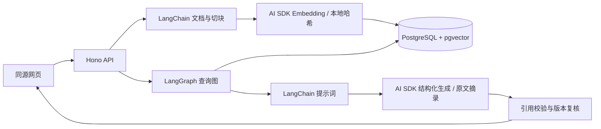
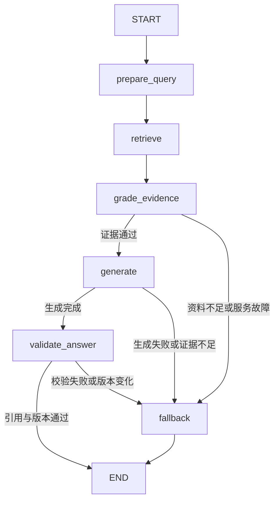

# RAG Lab：让回答有据可查

一个可交互的 RAG 教学 demo，使用 **Hono + PostgreSQL/pgvector + LangChain + LangGraph + Vercel AI SDK**。前端使用同源网页与 **React Flow** 执行图，不需要 Next.js。没有 Cloudflare 运行依赖。

本文根据 RAG 系列阅读、官方文档与本 demo 的实现重新归纳。示例资料均为自行编写的合成技术知识，不包含真实用户记忆、私有制度、账号信息、密钥或课程正文副本。

## 1. 能体验什么

- 导入 8 份知识、编辑并发布新版本、删除正文和向量。
- 比较向量、关键词、混合检索，查看候选分数、两路排名与 RRF 排名融合。
- 提问后看到答案、原文片段、文档版本、引用 ID 与 LangGraph 节点耗时。
- 执行时通过 SSE 实时显示节点与分支；点击查看状态摘要，结束后逐步回看或播放回看。
- 用当前页面的最近 6 条消息进行追问，观察查询整理。
- 证据不足、检索不可用、生成失败分别进入明确分支。
- 运行 9 道固定问题的检索与证据门禁评测。

### 两种运行模式

| 模式 | PostgreSQL、切块、LangGraph | 向量与回答 |
|---|---|---|
| `RAG_MODE=demo` | 真实执行 | 本地特征哈希向量 + 原文句子摘录；不调用模型 |
| `RAG_MODE=live` | 真实执行 | AI SDK 调用配置的 Embedding 与生成模型 |

demo 用于理解数据流、版本和失败处理。它不具备真实语义模型的同义词能力，摘录也不是 LLM 的推理结果。真实模型调用失败会明确报失败，不会自动换成模拟输出。

## 2. 安装和启动

需要 Node.js 22+、pnpm、PostgreSQL 17 与 pgvector。数据库可通过 Docker 启动，或者使用已安装的原生 PostgreSQL。本项目锁定 pnpm 11.8.0，依赖使用 `pnpm-lock.yaml`。

在仓库根目录进入 demo：

```bash
cd KRISIN2026/ai-agent-demo/rag-system
pnpm install
cp .env.example .env.local
```

### 方式 A：Docker 数据库

```bash
docker compose up -d --wait
pnpm db:init
pnpm seed
pnpm dev
```

### 方式 B：本机已安装 PostgreSQL 和 pgvector

确保 `initdb`、`pg_ctl`、`postgres` 在 PATH 中，且 pgvector 对当前 PostgreSQL 版本可用。

```bash
pnpm db:local
pnpm db:init
pnpm seed
pnpm dev
```

`db:local` 只管理本项目 `.data/postgres`，默认监听 `127.0.0.1:55432`，使用密码认证。数据目录与临时初始化密码均被 Git 忽略。它不操作系统中其他数据库实例。Docker 与原生方式共用默认端口，选择一种运行。

打开 **http://127.0.0.1:3016**。

后续数据已初始化时，只需要启动数据库和 `pnpm dev`。`pnpm db:stop` 停止本项目原生数据库；`docker compose stop` 停止容器并保留卷。`pnpm db:init` 可重复执行，不删除现有资料。

若已有 pgvector 数据库，只需配置 `DATABASE_URL` 并执行 `db:init`、`seed`、`dev`。应用启动不自动创建扩展，初始化账户需要创建扩展与表的权限。生产查询账户应另设最小权限。

### 第一次实验

1. “知识库”中检查来源、版本和片段数。
2. 问“RRF 为什么按排名融合？”，核对答案中的 `[S1]` 与来源片段。
   在执行图中点击“召回资料”和“证据门禁”，查看进入前状态、节点更新与完成后状态。点击“播放回看”以 500ms 每事件重放，或使用滑块与上一步/下一步逐项检查；这只是回看速度，图中耗时仍来自实际执行。
3. 展开召回候选，比较向量相似度、关键词覆盖和 RRF 分数。
4. 问“火星温室番茄种植温度是多少？”，观察资料不足分支。
5. 编辑某条文档，观察 revision 增加；重复保存不变的内容，观察无需重算。
6. 运行评测，再调整配置或文档，比较逐题结果。

恢复示例会覆盖相同示例 ID 的编辑内容，页面会先提示；自定义 ID 不受影响。

## 3. AI 与环境变量

配置沿用 `../agent-stack-web/.env.example` 的 `OPENAI_API_KEY`、`AI_MODEL`、`OPENAI_BASE_URL` 命名，只在服务端读取。`.env.example` 是无密钥模板，真实值放在被忽略的 `.env.local`。

切换真实模式，编辑 `.env.local`：

```dotenv
RAG_MODE=live
OPENAI_API_KEY=填写你的服务端密钥
AI_MODEL=填写你的服务支持的聊天模型
# OPENAI_BASE_URL=https://your-provider.example/v1
EMBEDDING_MODEL=text-embedding-3-small
EMBEDDING_DIMENSIONS=1536
```

保存后重启 `pnpm dev`，再执行 `pnpm seed` 或逐份重新保存，以当前模型重建索引。示例中的 `AI_MODEL` 继承相邻 demo 约定，模型是否可用由实际服务决定。

Embedding 可走独立兼容服务，设置 `EMBEDDING_API_KEY` 与 `EMBEDDING_BASE_URL`；未设置时复用 `OPENAI_*`。服务需要支持 `/embeddings` 和对应模型；生成侧使用 OpenAI 兼容 **Chat Completions**，并要求支持 JSON Schema 结构化输出。仅提供聊天 API 的服务不能替代 Embedding 服务。

| 配置 | 用途 |
|---|---|
| `DATABASE_URL` | 数据库连接，仅服务端可见 |
| `RAG_TENANT_ID` | 本地演示固定检索范围，浏览器不能覆盖 |
| `CHUNK_SIZE` / `CHUNK_OVERLAP` | 切分字符数与重叠量，不是 Token 数 |
| `RECALL_K` | 每路初步召回数量 |
| `CONTEXT_K` / `CONTEXT_CHAR_BUDGET` | 最终来源数量与正文字符预算 |
| `MIN_VECTOR_SCORE` / `MIN_KEYWORD_SCORE` | 演示证据门禁阈值，需要针对自己的问题集校准 |
| `LANGSMITH_TRACING` | 默认关闭；开启后 LangGraph/LangChain 可向远程记录图轨迹 |

### 模型变更为什么需要重新索引

向量的语义空间取决于供应商地址、模型和维度。本 demo 为这个组合生成 `embedding_profile`，查询只接受匹配 profile 的当前文档。demo 和 live 的向量也不会混搜。

profile 变化后未重建的资料会在页面标记需要重新索引。它们仍可编辑，但不进入新 profile 的查询。切块配置变化会生成新的处理版本，重新保存时会触发重建。

### 轨迹与敏感数据

默认轨迹仅随响应展示在本地页面，没有持久化完整问题和答案。开启 LangSmith 会把图状态中的问题及来源片段传向该服务，只适合确认允许上传的资料；这里不是自动脱敏的生产观测系统。AI SDK 请求的完整供应商轨迹与 Embedding Token 费用尚未接入，页面只显示生成 Token。

## 4. 技术如何协作



LangChain 负责 `Document`、递归切块和 `ChatPromptTemplate`。LangGraph 负责状态与路径。AI SDK 负责 Embedding 与结构化模型调用。PostgreSQL 保存权威正文、版本、任务状态和向量。

### 查询图的 Node、Edge 与 State



- **Node** 执行一个职责，返回需要更新的状态字段，例如检索节点返回候选。
- **Edge** 指定执行顺序；条件边读取状态，选择生成或降级。
- **State** 保存问题、检索查询、候选、证据、状态和答案。节点按默认覆盖规则更新字段。

每次请求独立创建图、闭包和轨迹。模型客户端及数据库连接不放进图状态。本 demo 没有 Checkpointer，所以图状态不会跨请求持久化；多轮历史只是浏览器本页内存，刷新就消失。

回答在结构化输出、引用和版本复核完成后一次性返回。没有把未验证的模型文本提前流给用户，也没有模拟 Token 流。

### React Flow 如何显示实际运行

网页使用 `POST /api/query/stream`。Hono 的 SSE 响应依次发送 `progress` 和最终 `result`；异常以 `error` 结束。LangGraph 节点包装器在真实开始/返回时产生 `node_start`、`node_end`，整轮使用同一个 traceId 与递增 seq，并记录实际 elapsedMs/durationMs。图不通过计时器猜测后端进度。

正常路径为“整理查询 → 召回 → 证据门禁 → 生成 → 引用校验 → 结束”；资料不足、检索异常、生成异常或引用失败会进入降级。执行中为紫色，完成为绿色，失败/取消为红色，未执行节点变灰。生成和引用校验已分离，未经检查的正文不会在事件中提前展示。

本地模式通常几十毫秒完成，浏览器可能在一次绘制中收到多个事件。时间线保留每次真实更新，可手动或自动回看。回看明确标记为回看，500ms 间隔仅用于观察，不改变后端耗时。刷新或新提问会清空这份本页记录，目前图展示查询工作流，不展示导入、删除或评测内部步骤。

节点详情显示问题、查询、候选来源、证据数、字符预算、状态和引用 ID 等摘要，不是全量图 State 或模型内部思考。取消按钮同时中止浏览器响应流和后端请求；已经开始的数据库操作或不支持取消的供应商可能仍需完成，节点返回前再次检查取消状态，取消后不发布答案。

React Flow 使用 esbuild 本地打包，`pnpm dev` 启动前自动执行 `build:web`。修改 React 组件后执行 `pnpm build:web` 并刷新页面；修改后端后重启服务。浏览器不依赖 CDN。

## 5. RAG 知识：先建立正确的边界

### 5.1 RAG、上下文、记忆和微调

RAG 在生成前选择外部信息，作用于本次上下文。微调改变模型参数；将最近几轮对话直接放入消息是上下文管理；长期记忆还包括提取、确认、更新、删除和冲突处理。它们可以组合，但不能用一个“memory”变量概括。

只翻译或提取当前输入时，信息已经齐全，可以直接调用模型。精确的余额、订单和权限应通过业务接口读取。资料很多、持续变化、每次只需要一小部分时，检索才有明显价值。

### 5.2 索引与查询是两类工作

索引链路在资料新增或变化时运行：读取、解析、清理、切块、生成向量、验证、发布。查询链路在提问时运行：整理问题、确定范围、召回、筛选、组装证据、生成。

不要每次提问重新解析 PDF 或计算全量文档向量。两条链路通过模型、维度、文档版本、元数据与处理版本保持一致。

本 demo 的索引在独立接口内等待完成，任务状态持久化；它尚不是队列消费者。生产应将大文件处理迁移到可重试的后台任务，查询继续使用已发布版本。

### 5.3 文档质量决定检索能看到什么

PDF、OCR、网页和表格的解析不是简单返回字符串。标题、表头、否定词、数字、版本、代码边界与适用条件都可能影响结论。清理先做低风险换行与空白标准化，再针对来源去除噪声。

切块应围绕完整语义：规则的条件与结果尽量留在一起。块太大会混合主题，块太小会失去上下文；Overlap 缓解切分边界，但过大会制造重复候选。默认 600/80 只是字符级起点，不是通用推荐。

父子块可用小块检索，再扩展到必要章节或邻居供模型阅读。本 demo 只补文档标题，尚未实现 Markdown 标题树、父子块或 PDF/OCR 解析。

### 5.4 向量空间、距离和精确标识

Embedding 是文本的数字表示，不是可读摘要。索引与查询必须使用兼容的模型空间；维度相同不能证明两个模型兼容。

pgvector 的 `<=>` 是余弦距离，距离越小越近。本 demo 用 `1 - 距离` 显示相似度。余弦分数不是正确概率，不能把 0.8 解释成“答案有 80% 正确率”。[pgvector 文档](https://github.com/pgvector/pgvector)

向量适合同义表达，精确错误码、函数名、编号和版本通常还需要关键词或业务查询。本 demo 的中文关键词支路使用二元组与完整英文标识的覆盖率，使用 PG 数组及 GIN 索引；**不是 BM25，也不是完整中文分词器**。查询代码为方便同时展示两路分数采用精确评分，小规模有效但不是大库查询计划。

### 5.5 多召回、少入上下文

初步召回争取不漏答案；最终上下文需要相关、互补且足够。两者的 K 分开配置。重复内容、旧版本和旁支主题会消耗上下文并影响答案。

向量与关键词分数尺度不同，可以用 RRF 按排名融合：

```text
RRF(d) = Σ 1 / (60 + rank_i(d))
```

这里 60 是实现中的平滑常数。RRF 不能替代重排；重排模型同时阅读查询与候选，可以改善排序，但不能创造未召回的资料。本 demo 实现 RRF、阈值筛选、正文去重和预算控制，尚未接入专用 Reranker/MMR。

### 5.6 权限过滤与版本复核解决不同问题

预过滤让无权或不适用的内容不参与候选竞争，避免全库 Top-K 被无权资料占满。查询范围必须来自可信服务端，不能相信客户端传入的 tenantId。

版本复核用于防止索引与事实状态不同步，以及生成期间文档已经变化。本 demo 在 SQL 内按租户、profile、当前 revision JOIN，并在筛选及返回答案前复核。最后一次复核后仍可能有新的编辑，这属于并发快照的边界；需要严格撤回历史答案时，应另做答案版本管理与失效事件。

本服务固定一个本地租户，只有仓储层的隔离测试，**尚未实现真实登录、ACL 或数据库 RLS**。上线多人应用前应把固定范围替换成认证后的允许范围，并按敏感度选择逻辑或物理隔离。

### 5.7 无答案属于正常结果

向量库总能找到最相近的东西，但“最相近”不一定回答问题。判断需要综合相关度、关键条件覆盖、来源冲突、版本和索引可用性。

demo 用两个经配置的阈值与上下文预算做基础门禁，live 还允许模型输出 `insufficient=true`。这不是完备的语义充分性判定。需要收集明确有答案、相近无答案和完全无关的问题，重新校准。

`insufficient` 表示缺少证据，`unavailable` 表示检索/Embedding 服务异常，`generation_failed` 表示模型、结构化输出或引用校验失败。不同状态有不同提示。

### 5.8 引用与 Prompt Injection

引用需能回到来源、版本和实际片段。系统验证答案中的 `[S1]` 与结构化 `citationIds` 来自最终上下文，但 ID 合法不证明每句话真的受来源支持，还需忠实度评测。

检索资料是数据，文档中的“忽略规则”不能升格为系统指令。提示词把资料作为 JSON 参数传入，网页通过 `textContent` 展示。本 demo 没有执行工具，资料不能触发邮件、SQL 或外部操作。生产 Agent 增加工具时仍需参数校验、最小权限和 Policy Gate；分隔符本身不能提供安全保证。

### 5.9 生产一致性与发布

文档、Chunk、向量、关键词索引、缓存和引用关系都需要更新与删除策略。Embedding 升级或切块策略整体变化，应建立新版本并评测后切换，而不是把不同向量混搜。

本 demo 将向量准备放在事务外，发布阶段用来源锁和 expected revision 防止乱序；正文与全部新块在同一事务中更新，再删除旧块。失败时旧版本保持可读。相同内容、profile 和处理版本重复提交会跳过重算。文档删除通过外键级联清理。

生产还需队列幂等、任务恢复、孤儿数据检查、内容保留与脱敏、模型与 Prompt 版本、缓存失效、影子流量、灰度和独立回滚。

### 5.10 记忆 RAG 如何迁移到 PostgreSQL

最近消息按时间读取，会话摘要作为整体读取，稳定长期记忆按需语义检索。不要把所有历史消息混成一个向量库就认为完成记忆。

长期记忆表可保存 userId、agentId、active、revision、类型、内容、来源与更新时间；向量保存对应 ID/profile。检索以语义为主，重要度与时间辅助；不同尺度可以通过带权排名融合。当前表达优先于旧偏好，临时状态不能变成永久标签。

记忆停用或删除后，权威数据库应立即拒绝返回，即使异步向量清理尚未完成。普通闲聊可以跳过检索；索引故障时继续依赖近期消息和摘要。本文介绍这套设计，本 demo 目前实现的是文档知识库，没有记忆提取、确认或管理功能。

## 6. 如何评测、排查和控制成本

### 分层指标

| 层次 | 指标 | 说明 |
|---|---|---|
| 召回 | Recall@K | 全部标注相关资料中进入前 K 的比例 |
| 候选 | Precision@K | 前 K 中真正相关的比例 |
| 单核心来源 | Hit Rate@K | 至少一次命中核心来源的问题比例 |
| 排序 | MRR@K | 前 K 中首个相关来源的倒数排名均值；未命中为 0 |
| 生成 | Correctness / Groundedness | 事实正确及是否受到证据支持 |
| 引用 | Citation Accuracy | 引用是否真正支持对应说法 |
| 无答案 | Abstention Accuracy | 应拒答时是否正确拒答 |
| 运行 | P50/P95、Token、成功回答成本 | 质量之外的性能与预算 |

固定问题集应覆盖中文口语、同义表达、错别字、精确词、多轮指代、数量与否定约束、版本、权限和无答案。平均分之外还应按标签分组，保留逐题结果。线上失败经人工确认后回流数据集，避免把用户没点踩当成正确。

本 demo 只计算 Hit Rate@5、MRR@5 和基础门禁，评测 8 道有答案、1 道无答案；没有 LLM-as-a-Judge、完整生成评测或独立保留集。修改内置文档会改变预期结果，先恢复示例再比较基线。

### 调优顺序

1. 确认原文存在且可访问，检查解析及切块。
2. 查看原问题、改写问题、过滤和候选。
3. 正确来源未召回时调整查询、切块或检索路线。
4. 已召回但排名差时调整融合或接入重排。
5. 已进入上下文但回答错时，检查证据完整性、提示词和生成模型。
6. 每次只改变一个变量，在同一问题集上比较质量、延迟和费用。

### 成本拆分

总成本由文档 Embedding、查询 Embedding、可选改写、重排、生成输入输出，以及数据库与存储组成。只在有明确历史指代时改写，关键词模式不调用查询 Embedding。上下文数量、长度和回答上限都会影响生成成本。

模型比较应固定输入：比较 Embedding 时使用一致切块与问题；比较重排时固定候选；比较生成时固定最终证据。模型名、参数量或价格不能直接证明自己的资料效果更好。

## 7. 代码索引与 API

| 文件 | 职责 |
|---|---|
| `src/config.ts` | env 校验、模型 profile、策略版本 |
| `src/schema.sql` | 来源、向量、索引任务与索引定义 |
| `src/store.ts` | 文档切块、事务发布、删除、范围内检索与版本复核 |
| `src/retrieval.ts` | 中文二元组、演示向量、RRF、门禁、引用校验 |
| `src/models.ts` | AI SDK 模型适配与 LangChain 提示词 |
| `src/workflow.ts` | LangGraph 节点、条件边、失败状态与本地轨迹 |
| `src/fixtures.ts` / `src/evaluation.ts` | 合成资料与固定检索评测 |
| `src/app.ts` / `src/server.ts` | Hono API、静态页面与本机服务 |
| `src/local-db.ts` | 可选的原生本地 PostgreSQL 启停 |
| `web/` | 问答、知识库编辑与评测界面 |
| `web/react/flow.tsx` / `flow.css` | React Flow 执行图、节点详情与回看 |
| `web/events.js` | SSE 跨块解析与事件到图状态的投影 |
| `scripts-build.mjs` | 本地打包 React 与 React Flow |

| 方法与路径 | 用途 |
|---|---|
| `GET /api/status` | 就绪状态与不含密钥的公开配置 |
| `GET /api/documents` | 当前文档与最近索引任务 |
| `POST /api/documents` | `{id,title,body}` 写入及重建 |
| `DELETE /api/documents/:id` | 删除当前服务端范围内的来源 |
| `POST /api/seed` | 导入或恢复示例 |
| `POST /api/query` | `{question,history?,retrieval?}` 检索和回答 |
| `POST /api/query/stream` | 同样输入，实时节点事件与已验证的最终结果 |
| `POST /api/eval` | 运行固定问题集 |

写请求使用 `Content-Type: application/json`，单次请求体不超过 80KB。示例 HTTP 调用：

```bash
curl http://127.0.0.1:3016/api/query \
  -H 'Content-Type: application/json' \
  --data '{"question":"RRF 为什么按排名融合？","retrieval":"hybrid"}'
```

服务只监听本机，没有启用公共 CORS；这是本地教学入口，不能直接发布为公网多租户服务。

## 8. 验证与当前边界

```bash
pnpm typecheck
pnpm test
pnpm test:integration
pnpm eval
```

集成测试连接 `.env.local` 中的数据库，自动建表，仅使用随机测试租户并清理自己的行；数据库需要专用于本 demo。未提供 `DATABASE_URL` 时集成测试会明确跳过，不能把跳过当成通过。

2026-09-29 已验证本地 PostgreSQL/pgvector 链路、服务端及 React 类型检查、7 个单元测试与 11 个数据库集成测试（含父级测试），包括重复导入、版本切换、模型失败保留旧数据、过期任务、租户与模型空间隔离、删除、无答案、降级、取消及 HTTP 合约。实时流测试将模型调用暂停，确认客户端在释放模型前已经收到节点进入事件，并检查引用校验之后才发布答案、无效引用走降级、执行中取消不会误标完成。合成评测为 9/9，Hit Rate@5 为 100%，MRR@5 为 0.8125；这些结果不代表真实语义生成质量。浏览器也验证了问答、来源、资料不足、文档新增与版本更新、删除和评测页面；React Flow 验证了正常/降级路径、未执行分支、点击节点详情、事件回看及自动回看。

本次没有调用真实外部 Embedding/LLM，也没有验证 LangSmith 上传、Docker 启动、PDF/OCR、专用重排、HNSW 或公网登录。结构化调用的兼容性还需用实际服务验证。

## 9. 官方参考

- [Hono Node.js](https://hono.dev/docs/getting-started/nodejs)
- [LangChain 检索](https://docs.langchain.com/oss/javascript/langchain/retrieval)
- [LangGraph Graph API](https://docs.langchain.com/oss/javascript/langgraph/use-graph-api)
- [AI SDK Embeddings](https://ai-sdk.dev/docs/ai-sdk-core/embeddings)
- [AI SDK 结构化生成](https://ai-sdk.dev/docs/ai-sdk-core/generating-structured-data)
- [pgvector](https://github.com/pgvector/pgvector)
- [React Flow](https://reactflow.dev/learn)
- [Hono SSE Streaming](https://hono.dev/docs/helpers/streaming)

API 以当前安装包、锁文件和官方文档为准。代码注释集中解释数据边界、一致性与失败处理，避免逐行复述语法。
