# 知识图谱

整理计算机基础、编程范式、前端工程化及网络知识相关图谱。点击标题可直达对应图片；内容仅在本目录展示，不在仓库首页展开。

## 前端工程化

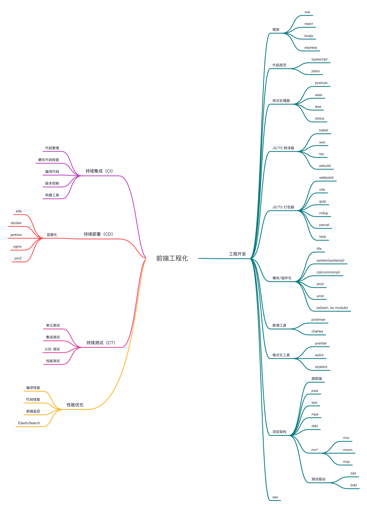

## BFF基础图谱

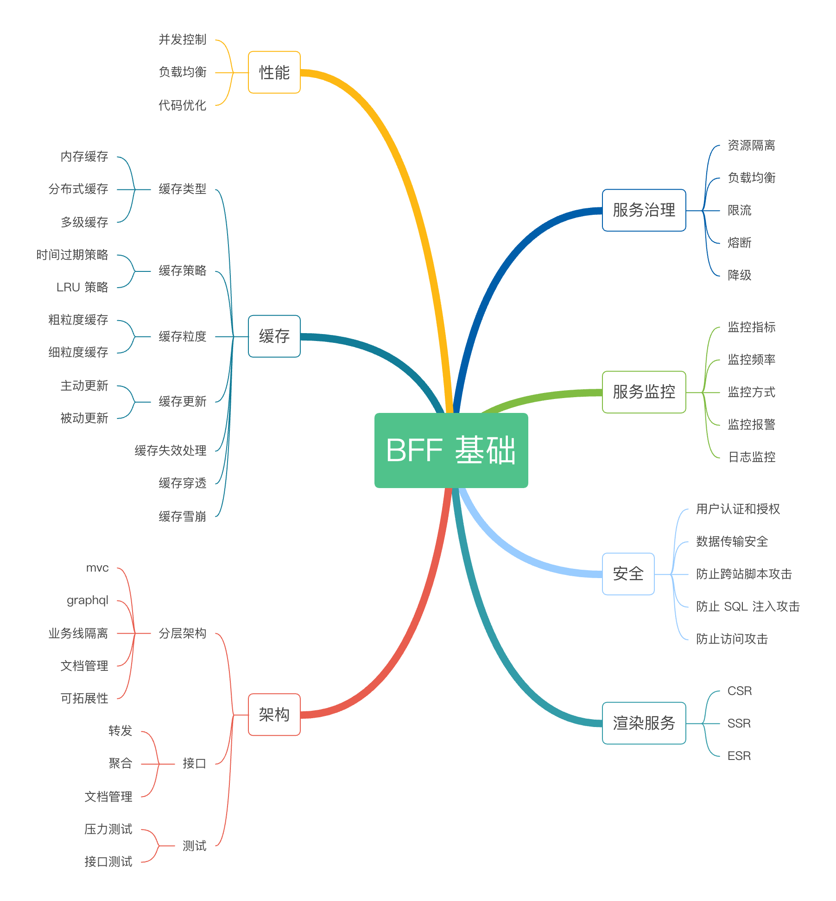

## 面向对象

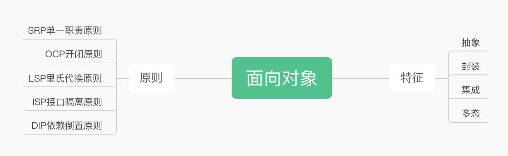

## 网络知识图谱

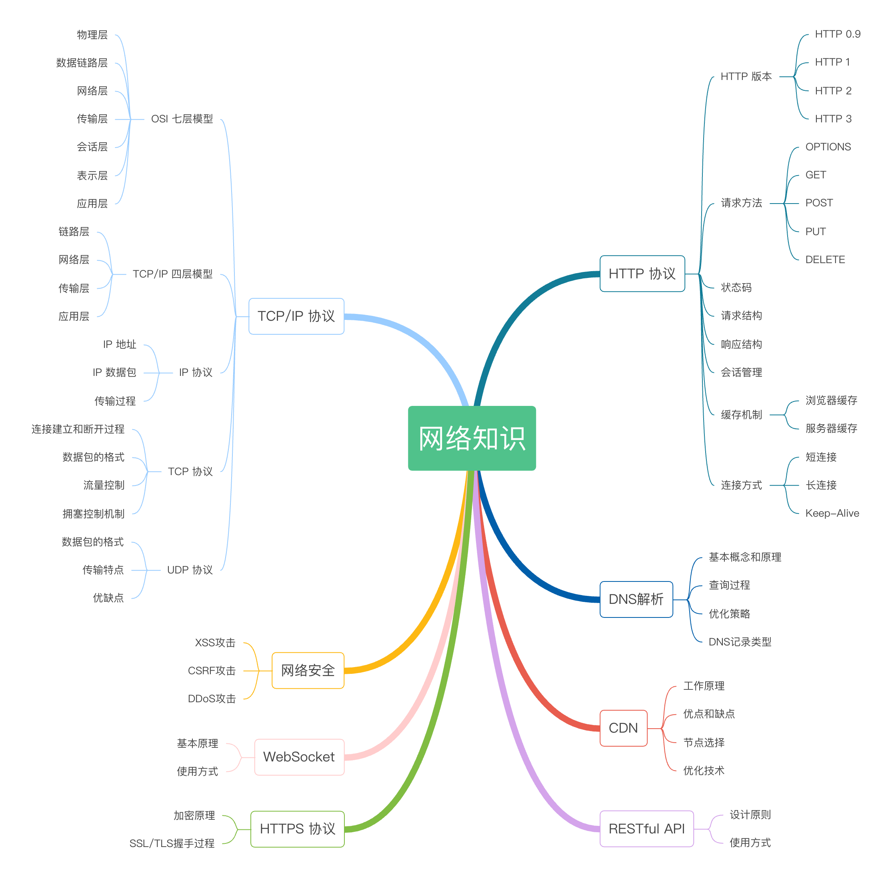

## knowledge

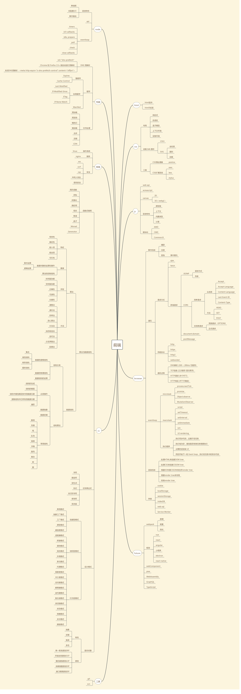

## 函数式编程

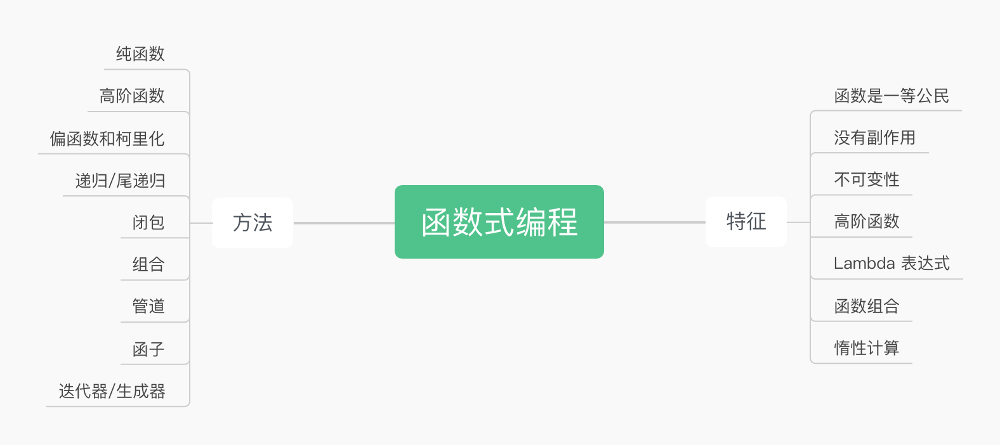

## 浏览器知识图谱

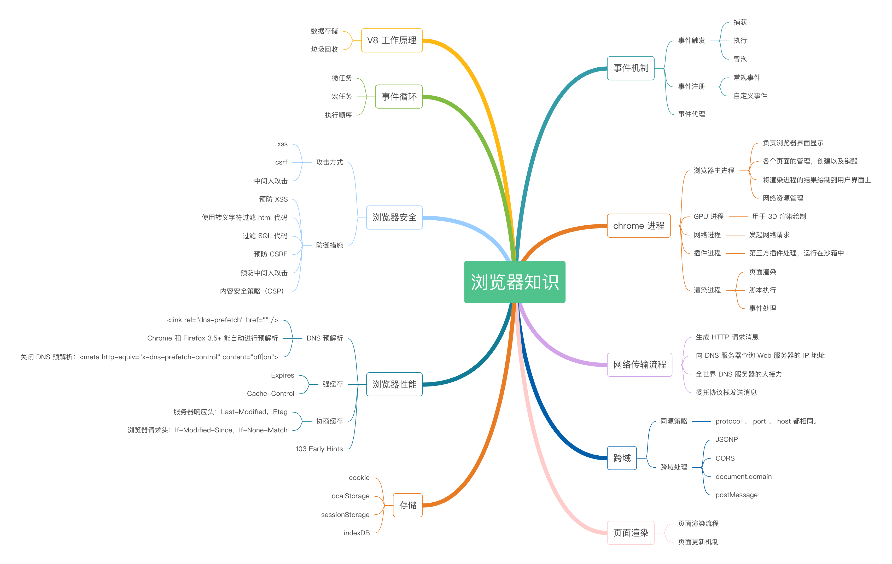

## 编译原理

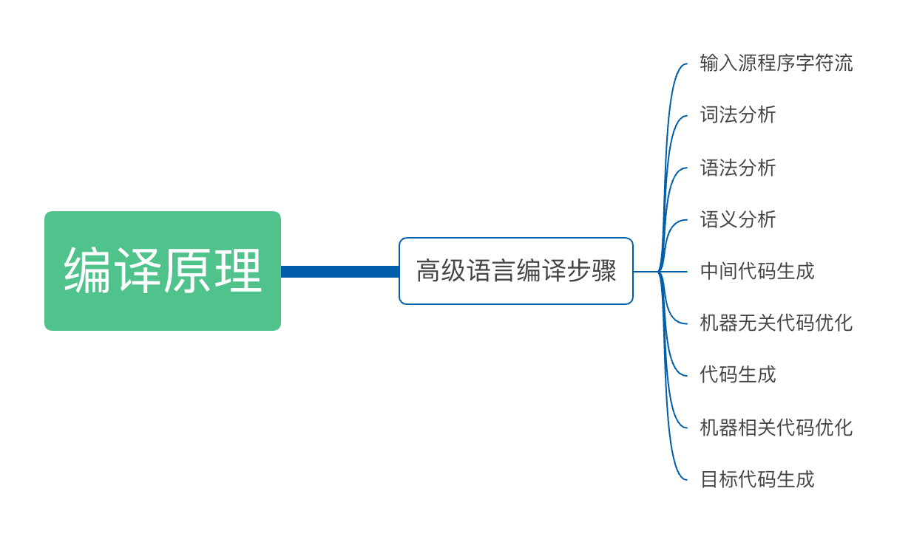

## 算法与数据结构

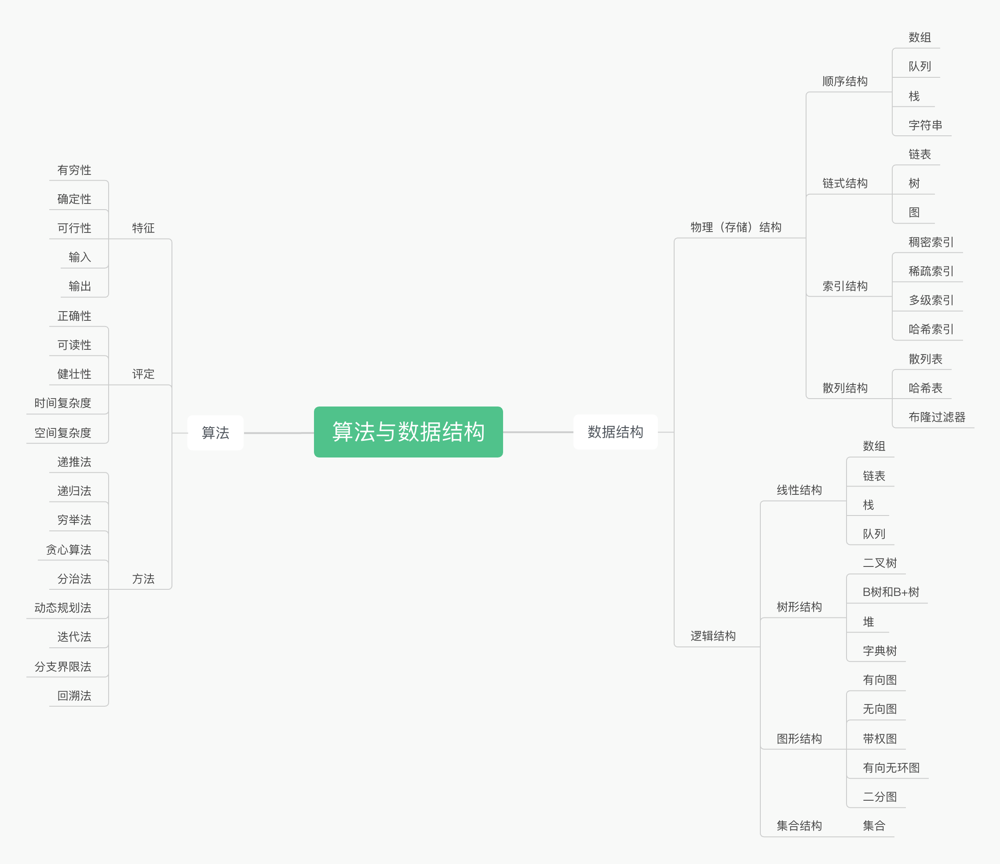

## 设计模式

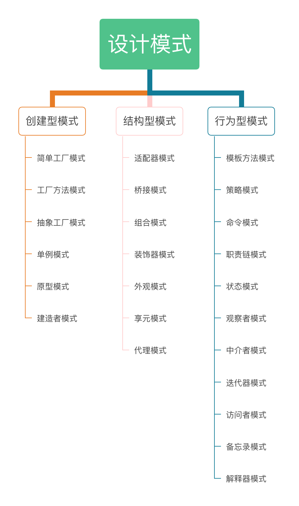

## 正则表达式

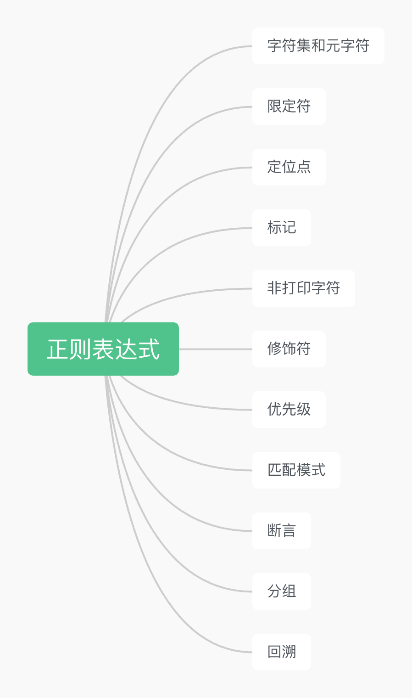

## 计算机组成原理

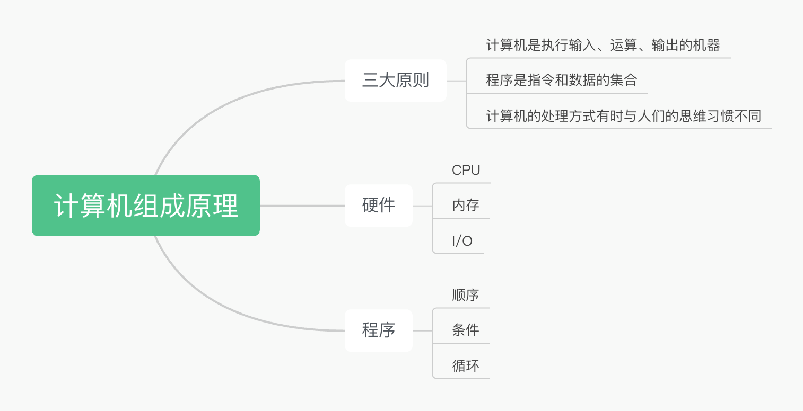

[返回仓库首页](../README.md)
